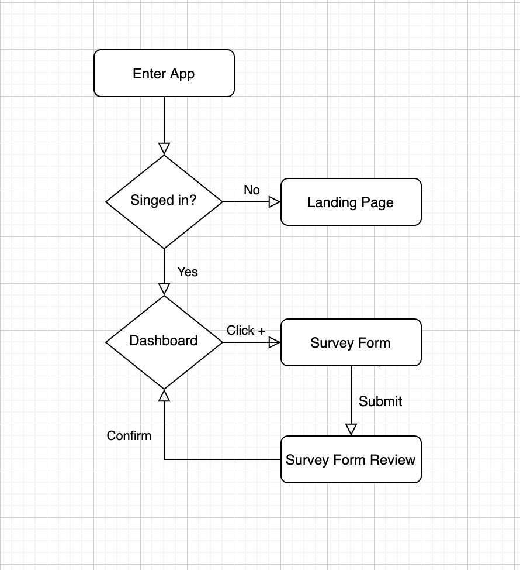

# Emaily
#### Link: https://arcane-eyrie-11866.herokuapp.com/

## Overview
* #### Send out surveys to your custemeres and collect feedback effectively to improve your service!
* #### Full-stack application primarily developed with MERN stack.
* #### This application was developed as a learning experience from a Udemy course (Stepehn Grider) Link at the bottom
* #### Some features including delete survey are added to the original structure

## Workflow

#### Please note that it might take a while for the initial loading
- Click the link -> you will be directed to ...herokuapp.com/
- Sign up with your Google Email
- You must have credits to send out emails
  * It won't actually charge you real money!
  * Click `Add Credits` on the top-right corder
  * Make sure you put `4242 4242 4242 4242` for Credit Card Number and `any valid MM/YY` that's ahead of your current time
  * Beisdes these fields, you can type anything. It will give you 5 credits each time
- Click start and you will be directed to `Dashboard`
- To add an survey, click `+` in the lower-right corner
- Fill out the survey request form and click `proceed`
  * recipient list is a list of comma-separated emails
- Double check your request and click `Confirm`
- Survey Emails will be sent to the recipients and once the recipient clicks `yes` or `no`, the `yes` and `no` number will be updated in the Dashboard
- If you utilize the survey result enough, feel free to delete it!

## Tech Stack
* **Front-End**
  * React
  * Redux
  * Materialize-css
* **Back-End**
  * Node.js
  * Express
  * MongoDB(Mongoose)
* **Authentication**
  * OAuth
  * Passport.js
* **Sending Emails & Credit Card Payment**
  * Sendgrid API - for sending emails
  * Stripe API - for user payment
* **Deployment**
  * Heroku
* **Webhook**
  * ngrok - connect to localhost
  
